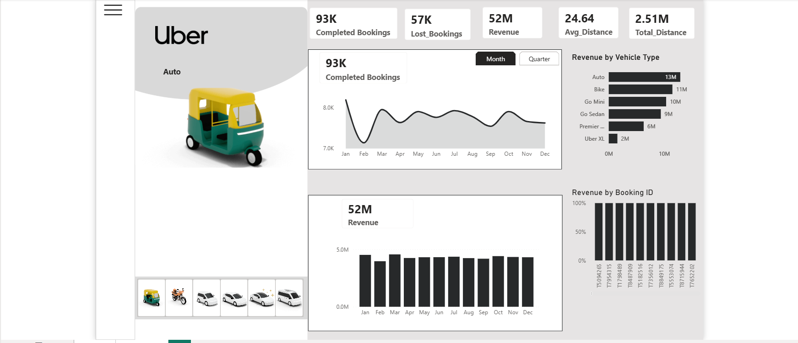

# 🚖 Uber Data Analysis Dashboard

  

  
  
  

---

## 📖 Project Overview

The **Uber Data Analysis Dashboard** is an interactive Business Intelligence solution developed in **Power BI**. It transforms raw Uber ride data into meaningful insights, enabling users to analyze booking trends, revenue performance, ride distances, and customer behavior through dynamic visualizations.

This dashboard helps stakeholders make informed business decisions by providing a clear and comprehensive view of Uber operations.

---

## 🎯 Objectives

- Analyze ride booking patterns.
- Monitor revenue performance.
- Track total ride distance covered.
- Identify peak demand periods.
- Understand customer behavior and preferences.
- Support data-driven decision making.

---

## ✨ Key Features

### 📌 KPI Cards
- Total Bookings
- Total Revenue
- Total Distance Covered
- Average Ride Distance
- Average Booking Value
- Total Customers

### 📊 Interactive Visualizations
- Booking Trend Analysis
- Revenue Insights
- Ride Category Distribution
- Distance Analysis
- Peak Hour Analysis
- Customer Insights
- Dynamic Filters and Slicers

---

## 📷 Dashboard Preview

<table>
<tr>
<td align="center">
<b>🏠 Home Page</b>  

</td>

<td align="center">
<b>📊 Overview Dashboard</b>  

</td>
</tr>
</table>

---

## 🛠️ Tools & Technologies

| Technology | Purpose |
|------------|---------|
| Power BI | Data Visualization & Reporting |
| Power Query | Data Cleaning & Transformation |
| DAX | Data Modeling & Measures |
| Excel / CSV | Data Source |

---

## 📈 Business Insights

✔ Track overall business performance

✔ Monitor revenue growth trends

✔ Analyze ride booking patterns

✔ Identify peak usage hours

✔ Evaluate customer engagement

✔ Support strategic decision-making

---

---

## 🚀 Dashboard Highlights

- Modern and Interactive Design
- User-Friendly Navigation
- Dynamic Filtering Capabilities
- Professional KPI Tracking
- Actionable Business Insights
- Clean and Responsive Layout

---

## 🔮 Future Enhancements

- Real-Time Data Integration
- Predictive Analytics
- AI-Based Forecasting
- Advanced Customer Segmentation
- Mobile Dashboard Optimization

---

  <b>🚖 Turning Uber Data into Actionable Business Insights 📊</b>

